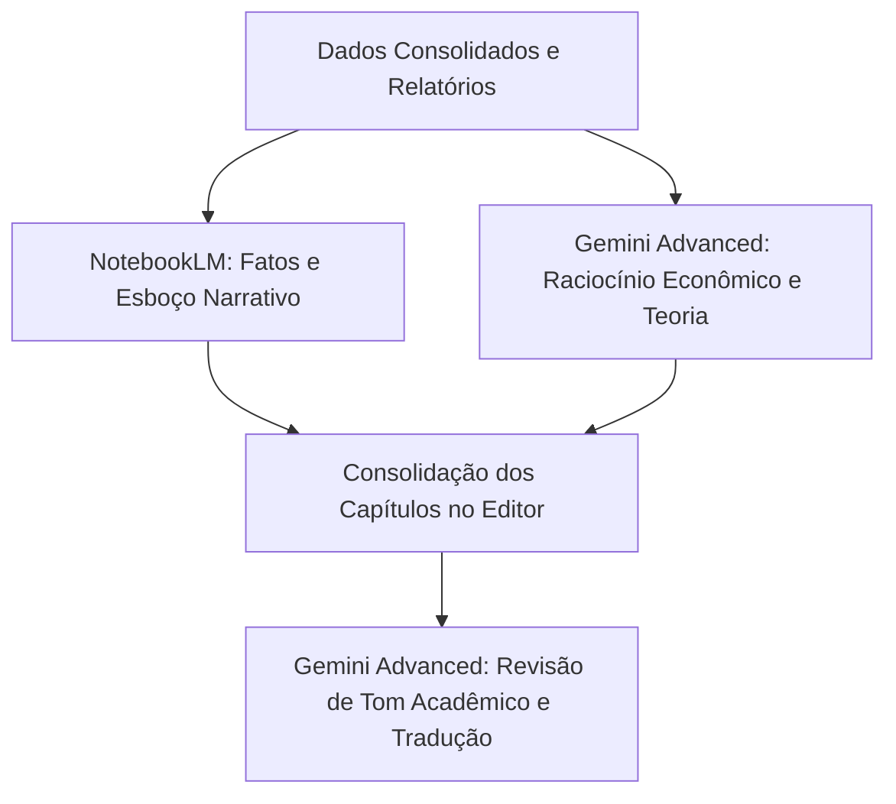

# Guia de Utilização da Base de Dados com IAs (Gemini & NotebookLM)

Este documento orienta como estruturar e subir os dados macroeconômicos e fiscais consolidados (2019–2026) nas ferramentas de Inteligência Artificial para enriquecer a redação, estruturação e consistência do seu TCC/Monografia.

---

## 💻 1. Como Usar no NotebookLM (Google)
O **NotebookLM** funciona como uma mesa de estudos personalizada de RAG (Geração Aumentada por Recuperação). As respostas fornecidas por ele serão estritamente ancoradas e citadas com base nas fontes que você subiu.

### Passo a Passo Recomendado:
1. **Crie um Novo Caderno (Notebook)** focado em seu TCC.
2. **Suba o Relatório Principal:** Faça upload do arquivo:
   * 📄 [relatorio_focus_ibge_notebooklm.md](file:///c:/Users/pcmar/expectativas-macro-2019-2026/output/exportacao_ia/relatorio_focus_ibge_notebooklm.md) (Contém a narrativa metodológica unificada, tabelas de MAE e viés consolidado para IPCA, Selic e PIB).
3. **Suba o Guia de Prompts:** Faça upload de [guia_prompts_ia.md](file:///c:/Users/pcmar/expectativas-macro-2019-2026/output/exportacao_ia/guia_prompts_ia.md) para que a IA conheça as perguntas sugeridas.
4. **Crie um Caderno Separado para a Dívida Pública (Opcional, mas Recomendado):**
   * Como a análise fiscal (DBGG e DLSP) possui suas próprias trajetórias e glossário, crie um caderno focado nela e faça upload de todos os 21 arquivos contidos na pasta [output/DIVIDA/NotebookLM/](file:///c:/Users/pcmar/expectativas-macro-2019-2026/output/DIVIDA/NotebookLM/).
   * *Dica:* Certifique-se de carregar o `00-glossario-conceitos.txt` e o `09-resumo-executivo.md` primeiro.

### Melhores Casos de Uso no NotebookLM:
* **Escrita de Capítulos:** Peça para a IA esboçar seções do TCC com base nas tabelas (ex: *"Esboce a seção de análise descritiva da Selic usando a Tabela X"*).
* **Verificação de Fatos:** Faça buscas semânticas rápidas (ex: *"Qual foi o pior erro de previsão do PIB e em qual ano ocorreu?"*).
* **Geração de Audio Overview:** Use o recurso de gerar um "podcast" de 2 pessoas discutindo a base de dados do seu TCC para ouvir os principais insights em formato de áudio.

---

## 🤖 2. Como Usar no Gemini Advanced
O **Gemini Advanced** (com modelo Gemini 1.5 Pro) possui uma janela de contexto gigante de 1 milhão de tokens e conta com um interpretador de código Python integrado. Ele é ideal para análises quantitativas dinâmicas, cruzamento de hipóteses econômicas e geração de novos gráficos.

### Passo a Passo Recomendado:
1. **Abra um chat limpo** no Gemini Advanced.
2. **Anexe o arquivo de síntese anual:** Comece anexando o arquivo:
   * 📊 `resumo_anual_todos_indicadores.csv` (localizado em [output/exportacao_ia/gemini/](file:///c:/Users/pcmar/expectativas-macro-2019-2026/output/exportacao_ia/gemini/)).
3. **Instrua a IA sobre a formatação:** Envie a instrução:
   > *"Estou anexando a base de dados consolidada do meu TCC do MBA da FIPE. O arquivo usa codificação UTF-8, o delimitador de colunas é a vírgula (,) e contém as estimativas iniciais do Focus confrontadas com os realizados do IPCA, Selic e PIB de 2019 a 2026. Por favor, confirme se leu os dados corretamente."*
4. **Anexe arquivos mensais para maior detalhamento:** Para análises específicas de inflação ou juros por reunião, anexe os arquivos correspondentes como `ipca_mensal_focus_vs_ibge.csv` ou `selic_copom_focus_vs_realizado.csv`.

### Melhores Casos de Uso no Gemini:
* **Cruzamento de Hipóteses:** Faça perguntas teóricas complexas (ex: *"Dado o prêmio de juros de 3,3 p.p. na Regra de Taylor no governo atual, como a literatura de dominância fiscal explica isso com base nos dados de DBGG?"*).
* **Simulações e Gráficos Rápidos:** Peça para o Gemini gerar gráficos interativos em Python baseados nos CSVs anexados.
* **Revisão e Tradução Acadêmica:** Use-o para traduzir o abstract para o inglês ou revisar a linguagem formal dos parágrafos da monografia.

---

## 💡 3. Fluxo de Trabalho Integrado para Redação

Para obter a profundidade máxima exigida por uma banca de MBA:

1. **Gere a base descritiva e histórica** no NotebookLM para não errar nenhum número.
2. **Questione o Gemini sobre o arcabouço teórico** e referências bibliográficas adequadas aos números encontrados.
3. **Redija a seção** combinando a precisão descritiva (NotebookLM) com a profundidade analítica (Gemini).
4. **Submeta o resultado final** ao Gemini com o prompt: *"Aja como um revisor de periódico de economia e aprimore o rigor acadêmico do seguinte texto: [seu parágrafo]"*.
